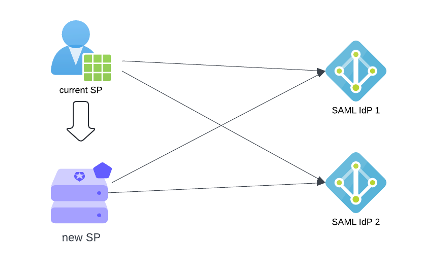
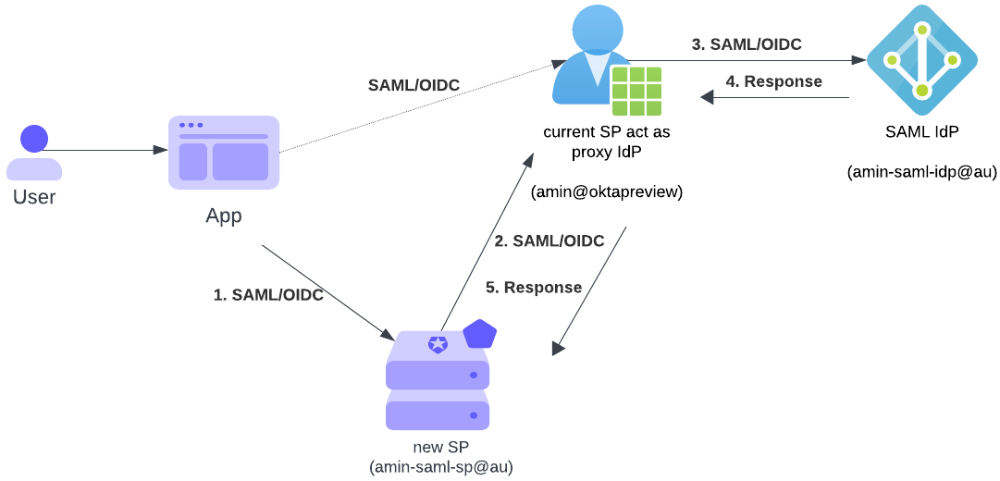

# SAML Migration Talk - Okta Developer Day 2024 

# Moving to new IdP

## Solution i1: Coexist; Current IdP becomes SP Proxy 

## Solution i2: Mimic IdP; upload signing key and replay requests

## Solution i3: SS-SSO; for gradual migration

# Moving to new SP

## Solution s1: Coexist; current SP becomes IdP

### Solution s2: Mimic SP; upload signing key and send signed request with new ACS

### Solution s3: Replay response and adjust destination/audience 

http://localhost:8080/realms/master/protocol/openid-connect/logout
http://localhost:8080/realms/master/protocol/openid-connect/auth?client_id=jwt.io&redirect_uri=https://jwt.io&response_type=id_token&nonce=n1