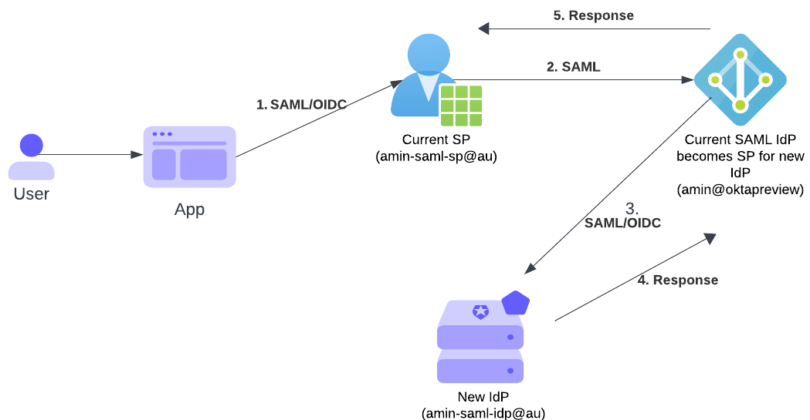

# Our assumptions in this talk

- You’re coming in with SAML knowledge
- No changes to either SP or IdP side
- Generic and vendor-agnostic using features that most vendors support
- We’ll see 3 solutions for moving IdP and 3 for moving SP

--- 

# Moving to new IdP

---

Solution i1: Coexist; Current IdP becomes SP Proxy 

--- 

Solution i2: Mimic IdP; upload signing key and replay requests

---

Solution i3: SS-SSO; for gradual migration

---

# Moving to new SP

---

Solution s1: Coexist; current SP becomes IdP

---

Solution s2: Mimic SP; upload signing key and send signed request with new ACS

---

Solution s3: Replay response and adjust destination/audience 

---
